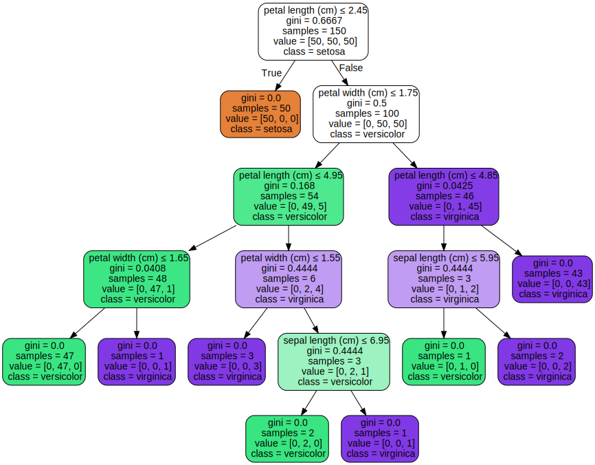
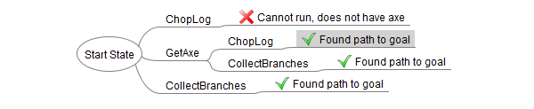

## Decision Trees


Root Node: This attribute is used for dividing the data into two or more sets.


Branch or Sub-Tree: A part of the entire decision tree is called a branch or sub-tree.


Splitting: Dividing a node into two or more sub-nodes based on if-else conditions.


Decision Node: After splitting the sub-nodes into further sub-nodes, then it is called the decision node.

Leaf or Terminal Node (Action): This is the end of the decision tree where it cannot be split into further sub-nodes.


Pseudocode:

```
class DecisionTreeNode
  fn call


class Decision < DecisionTreeNode
  branch_a: DecisionTreeNode
  branch_b: DecisionTreeNode

  fn call 
    // pics next branch or action based on condition
    get_branch().call()


  fn get_branch -> DecisionTreeNode
    check_conditions() ? branch_a : branch_b


  fn check_conditions -> bool


class Action
  fn call
    // work is performed here. It is end of life of decision tree 
```


#### notes
Decision tree can be used in a non-parametric supervised learning method used for classification and regression: https://scikit-learn.org/stable/modules/tree.html 



## State Machine

https://en.wikipedia.org/wiki/Finite-state_machine


## Fuzzy logic

Fuzzy decision making is the collection of single or multicriteria techniques aiming at selecting the best alternative in case of imprecise, incomplete, and vague data.

#### Fuzzy sets

Some value can represent how strong object is related to set. For example: there is group of hungry people. Level of hungryness can be between 0.0 and 1.0 (this value is called "degree of membership"). 
Person with hungryness 0.0 does not belong  to the group. But 0.1 do, person with 0.8 is more related. But both do.


Turning regular data into degree of membership is called "fuzzification".


## Markov model

https://en.wikipedia.org/wiki/Markov_model


## GOAP (Goal Oriented Action Planning)
Goal Oriented Action Planning (GOAP) is an AI system that will easily give your agents choices and the tools to make smart decisions without having to maintain a large and complex finite state machine.


There are goals which have cost(value). To satisfy the goal action(s) must be executed. The best match action should be picked to achive the goal.


Goal oriented action planning is an artificial intelligence system for agents that allows them to plan a sequence of actions to satisfy a particular goal. The particular sequence of actions depends not only on the goal but also on the current state of the world and the agent. This means that if the same goal is supplied for different agents or world states, you can get a completely different sequence of actions., which makes the AI more dynamic and realistic. Lets look at an example, as seen in the demo above.

We have an agent, a wood chopper, that takes logs and chops them up into firewood. The chopper can be supplied with the goal MakeFirewood, and has the actions ChopLog, GetAxe, and CollectBranches.

The ChopLog action will turn a log into firewood, but only if the wood cutter has an axe. The GetAxe action will give the wood cutter an axe. Finally, the CollectBranches action will produce firewood as well, without requiring an axe, but the firewood will not be as high in quality.

When we give the agent the MakeFirewood goal, we get these two different action sequences:
```
    Needs firewood -> GetAxe -> ChopLog = makes firewood
    Needs firewood -> CollectBranches = makes firewood
```
If the agent can get an axe, then they can chop a log to make firewood. But maybe they cannot get an axe; then, they can just go and collect branches. Each of these sequences will fulfill the goal of MakeFirewood. 

GOAP can choose the best sequence based on what preconditions are available. If there is no axe handy, then the wood cutter has to resort to picking up branches. Picking up branches can take a really long time and yield poor quality firewood, so we don’t want it to run all the time, only when it has to.

### Actions

An action is something that the agent does. Usually it is just playing an animation and a sound, and changing a little bit of state (for instance, adding firewood). Opening a door is a different action (and animation) than picking up a pencil. An action is encapsulated, and should not have to worry about what the other actions are.

To help GOAP determine what actions we want to use, each action is given a cost. A high cost action will not be chosen over a lower cost action. When we sequence the actions together, we add up the costs and then choose the sequence with the lowest cost.

Lets assign some costs to the actions:
```
    GetAxe Cost: 2
    ChopLog Cost: 4
    CollectBranches Cost: 8
```
If we look at the sequence of actions again and add up the total costs, we will see what the cheapest sequence is:
```
    Needs firewood -> GetAxe (2) -> ChopLog (4) = makes firewood (total: 6)
    Needs firewood -> CollectBranches (8) = makes firewood (total: 8)
```
Getting an axe and chopping a log produces firewood at the lower cost of 6, while collecting the branches produces wood at the higher cost of 8. So, our agent chooses to get an axe and chop wood.

But won’t this same sequence run all the time? Not if we introduce preconditions...

### Preconditions and Effects

Actions have preconditions and effects. A precondition is the state that is required for the action to run, and the effects are the change to the state after the action has run.

For example, the ChopLog action requires the agent to have an axe handy. If the agent does not have an axe, it needs to find another action that can fulfill that precondition in order to let the ChopLog action run. Luckily, the GetAxe action does that—this is the effect of the action.

### The GOAP Planner

The GOAP planner is a piece of code that looks at actions' preconditions and effects, and creates queues of actions that will fulfill a goal. That goal is supplied by the agent, along with a world state, and a list of actions the agent can perform. With this information the GOAP planner can order the actions, see which can run and which can’t, and then decide which actions are the best to perform. Luckily for you, I’ve written this code, so you don’t have to.

To set this up, lets add preconditions and effects to our wood chopper’s actions:
```
    GetAxe Cost: 2. Preconditions: "an axe is available", "doesn’t have an axe". Effect: "has an axe".
    ChopLog Cost: 4. Preconditions: "has an axe". Effect: "make firewood"
    CollectBranches Cost: 8. Preconditions: (none). Effect: "make firewood".
```
The GOAP planner now has the information needed to order the sequence of actions to make firewood (our goal). 

We start by supplying the GOAP Planner with the current state of the world and the state of the agent. This combined world state is:
```
    "doesn’t have an axe"
    "an axe is available"
    "the sun is shining"
```
Looking at our current available actions, the only part of the states that are relevant to them is the "doesn’t have an axe" and the "an axe is available" states; the other one might be used for other agents with other actions.

Okay, we have our current world state, our actions (with their preconditions and effects), and the goal. Let’s plan!

```
GOAL: "make firewood"
Current State: "doesn’t have an axe", "an axe is available"
Can action ChopLog run?
    NO - requires precondition "has an axe"
    Cannot use it now, try another action.
Can action GetAxe run?
    YES, preconditions "an axe is available" and "doesn’t have an axe" are true.
    PUSH action onto queue, update state with action’s effect
New State
    "has an axe"
    Remove state "an axe is available" because we just took one.
Can action ChopLog run?
    YES, precondition "has an axe" is true
    PUSH action onto queue, update state with action’s effect
New State
    "has an axe", "makes firewood"
We have reached our GOAL of  "makes firewood"
Action sequence: GetAxe -> ChopLog
```

The planner will run through the other actions, too, and it won’t just stop when it finds a solution to the goal. What if another sequence has a lower cost? It will run through all possibilities to find the best solution.

When it plans, it builds up a tree. Every time an action is applied, it is popped off the list of available actions, so we don’t have a string of 50 GetAxe actions back-to-back. The state is changed with that action’s effect.

The tree that the planner builds up looks like this:




We can see that it will actually find three paths to the goal with their total costs:
```
    GetAxe -> ChopLog (total: 6)
    GetAxe -> CollectBranches (total: 10)
    CollectBranches (total: 8)
```
Although GetAxe -> CollectBranches works, the cheapest path is GetAxe -> ChopLog, so this one is returned.

What do preconditions and effects actually look like in code? Well, that's up to you, but I have found it easiest to store them as a key-value pair, where the key is always a String and the value is an object or primitive type (float, int, Boolean, or similar). In C#, that could look like this:
```
HashSet< KeyValuePair<string,object> > preconditions;
HashSet< KeyValuePair<string,object> > effects;
```

When the action is performing, what do these effects actually look like and what do they do? Well, they don’t have to do anything—they are really just used for planning, and don’t affect the real agent’s state until they run for real. 

This is worth emphasising: planning actions is not the same as running them. When an agent performs the GetAxe action, it will probably be near a pile of tools, play a bend-down-and-pick-up animation, and then store an axe object in its backpack. This changes the state of the agent. But, during GOAP planning, the state change is just temporary, so that the planner can figure out the optimal solution.

https://gamedevelopment.tutsplus.com/goal-oriented-action-planning-for-a-smarter-ai--cms-20793t