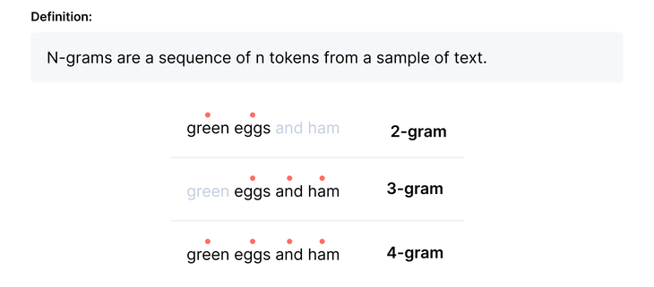
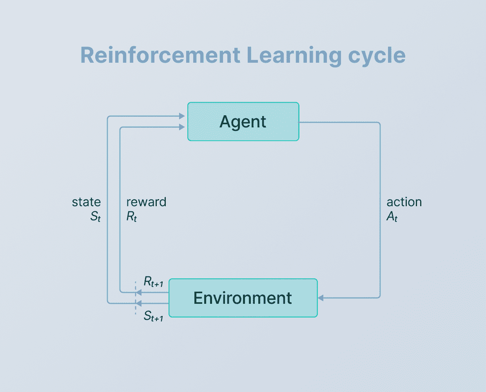
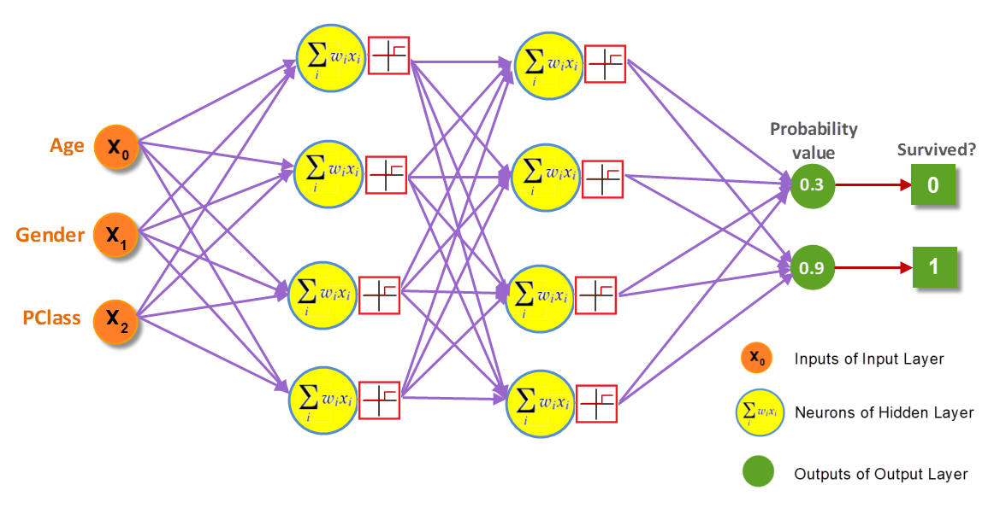
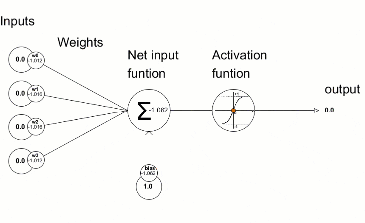

## Learning

### N grams



can be used for prediction of the following item.


### Naive Bayes Classifier

Naïve Bayes algorithm is a supervised learning algorithm, which is based on Bayes theorem and used for solving classification problems.
It is mainly used in text classification that includes a high-dimensional training dataset.
Naïve Bayes Classifier is one of the simple and most effective Classification algorithms which helps in building the fast machine learning models that can make quick predictions.
It is a probabilistic classifier, which means it predicts on the basis of the probability of an object.
Some popular examples of Naïve Bayes Algorithm are spam filtration, Sentimental analysis, and classifying articles


In plain language, using Bayesian probability terminology, the equation can be written as
```
posterior = prior × likelihood / evidence 
```


https://en.wikipedia.org/wiki/Naive_Bayes_classifier


### Decision tree learning

can build decision tree based on dataset.

Decision tree learning is a supervised learning approach used in statistics, data mining and machine learning. In this formalism, a classification or regression decision tree is used as a predictive model to draw conclusions about a set of observations. 

#### ID3 
- https://en.wikipedia.org/wiki/ID3_algorithm

#### ID4

#### C4.5

An incremental decision tree algorithm is an online machine learning algorithm that outputs a decision tree. Many decision tree methods, such as C4.5, construct a tree using a complete dataset. Incremental decision tree methods allow an existing tree to be updated using only new individual data instances, without having to re-process past instances. This may be useful in situations where the entire dataset is not available when the tree is updated (i.e. the data was not stored), the original data set is too large to process or the characteristics of the data change over time. 

#### C5


### Reinforcement learning

Range of techniques based on expierience. In its most general form a reinforcement learning algorithm has three components: 
- an exploration strategy for trying different actions
- reinforcement function that gives feedback on how good each action is
- learning rule that links two above together


Reinforcement learning deals with a unique problem setup where an arbitrary agent is trying to learn the optimal way of interacting with an environment. In return for its actions, it receives rewards; the agent’s goal is to find an optimal policy that maximizes cumulative numerical return.




#### Q learning

Q-learning is a model-free reinforcement learning algorithm to learn the value of an action in a particular state. It does not require a model of the environment (hence "model-free"), and it can handle problems with stochastic transitions and rewards without requiring adaptations.


For any finite Markov decision process (FMDP), Q-learning finds an optimal policy in the sense of maximizing the expected value of the total reward over any and all successive steps, starting from the current state. Q-learning can identify an optimal action-selection policy for any given FMDP, given infinite exploration time and a partly-random policy. "Q" refers to the function that the algorithm computes – the expected rewards for an action taken in a given state.


Fits for state machines, decision trees.


### Neural network

We could use decision tree learning to solve this problem: the output values correspond to the leaves of the decision tree, and the input values are used in the decision tree tests. If we used an incrmental algorithm (such as ID4), we would also be able to learn from our mistakes during the game. For classification problem like this, decision tree learning and neural networks are viable alternatives.

Decision trees are accurate. They give a tree that correctly classifies from the given examples. To do this, they make hard and fast decisions. When they see a situation that wasnt represented in their examples, they will make decision based on it. Because their decision making is so hard and fast, they arent so good at generalizing by extrapolating into gray areas beyond the examples. Neural networks are not so accurate. They may even give a wrong responses for the examples provided. They are better, however, at extrapolating into those grey areas.





How many hidden layers NN should have?

- Majority of problems can be solved with 1-2 layers


How many neurons layer should have?

- the number of hidden neurons should be between the size of input layer and the size of output layer


Usefull links

- Types of NN https://towardsdatascience.com/the-mostly-complete-chart-of-neural-networks-explained-3fb6f2367464

- NN from scratch explained https://www.youtube.com/watch?v=Wo5dMEP_BbI&list=PLQVvvaa0QuDcjD5BAw2DxE6OF2tius3V3

- Q learning https://www.youtube.com/watch?v=yMk_XtIEzH8&list=PLQVvvaa0QuDezJFIOU5wDdfy4e9vdnx-7&index=1

- Deep Learning: Which Loss and Activation Functions should I use? https://towardsdatascience.com/deep-learning-which-loss-and-activation-functions-should-i-use-ac02f1c56aa8

- How many hidden layers and neurons do you need in your artificial neural network? https://www.youtube.com/watch?v=bqBRET7tbiQ


### Deep learning

Deep learning is a subset of machine learning, which is essentially a neural network with three or more layers. These neural networks attempt to simulate the behavior of the human brain—albeit far from matching its ability—allowing it to “learn” from large amounts of data. While a neural network with a single layer can still make approximate predictions, additional hidden layers can help to optimize and refine for accuracy.
