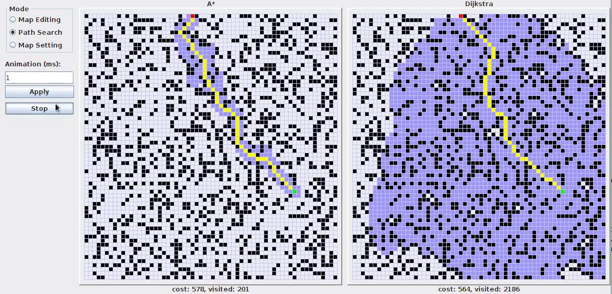

## Pathfinding

dijkstra vs a* https://www.youtube.com/watch?v=g024lzsknDo

### Dijkstra
shortest(cheapest) path between nodes A and B. It does this by finding the shortest paths from one node A to all other nodes, which will, of course, include B Works with directional, weighted graphs. 

Can be implemented to work with grids.

https://en.wikipedia.org/wiki/Dijkstra%27s_algorithm

### A* (A Star) Algorithm

Informed searching algorithms don't just use the information about possible actions to modify the current state of the problem, but also additional information that would direct the search towards the goal. This additional information is some type of score, an indicator of a quality of a certain state. This indicator is not necessarily exact, it's usually just an approximation.

This approximation is usually called a heuristic, derived from the Greek word "heurisko", meaning "to search" or "to discover".

A function that calculates the score (quality) of a certain state is called an evaluation function. If this function is h, then h(n) represents the score of state n.

Each time an informed search algorithm enters a state, it calculates the value f(n) for each of its neighbor states, and afterwards enters the node with the most optimal value of f(n).

The A* algorithm is based on heuristics for navigating the search.

Can be implemented to work with grids.

https://en.wikipedia.org/wiki/A*_search_algorithm

Variants:

- Anytime A*

- Block A*

- D*

- Field D*

- Fringe

- Fringe Saving A* (FSA*)

- Generalized Adaptive A* (GAA*)

- Incremental heuristic search

- Reduced A*

- Iterative deepening A* (IDA*)

- Jump point search

- Lifelong Planning A* (LPA*)

- New Bidirectional A* (NBA*)[31]

- Simplified Memory bounded A* (SMA*)

- Theta*

https://www.youtube.com/watch?v=aKYlikFAV4k

### Usefull links
Graph https://en.wikipedia.org/wiki/Graph_(abstract_data_type) 

