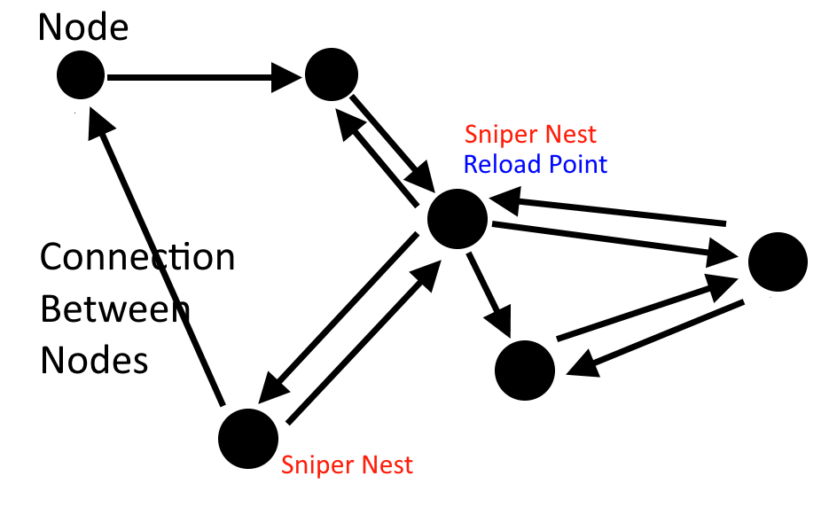
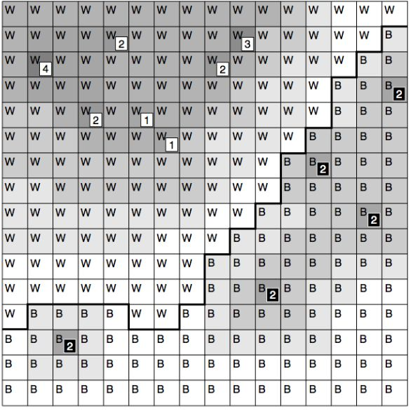
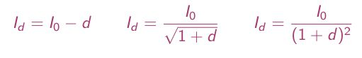
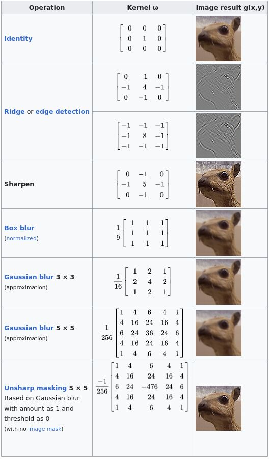
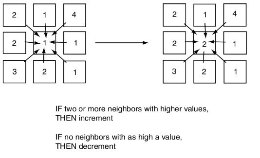

## Tactical and srategic AI

### Waypoint Tactics

Waypoints, in terms of pathfinding, are positions in a level that a pathfinding system uses to connect areas of the level. In normal pathfinding, they’re essentially used to tell an AI how to get from point A to point B without walking through walls or taking a route that seems unreasonable to a player. Waypoint tactics is the idea of giving waypoints more information so that AI can make more complex and informed decisions. Examples of waypoints are sniper nests and places that it is safe to heal. This type of system is insanely helpful for designers because it allows them to place key interest points wherever they’d like in the level without having to have the programmers implement new systems for each of them. It also makes controlling the habits of larger groups of AI much easier.

https://timpcarbone.com/2019/12/09/artificial-intelligence-in-games-waypoint-tactics/

### Tactical Analysis

Primarily present in Real-time strategy (RTS) games

- influence mapping: determining military influence at each location
- terrain analysis: determining the effect of terrain features at each location

But other tactical information too: eg, regions with lots of natural resources
to focus harvesting/mining activities.

#### Influence Maps

game level split into chunks made of locations of roughly same properties for any tactics we are interested in 
(like in pathfinding: Dirichlet domains, floor polygon, tile-based grid and imposed grid for non-tile-based levels, ...)

an influence map keeps track of the current balance of military influence at each location in the level

simplifying assumption: military influence is a factor of the proximity of enemy units and bases and their relative military power 
(there may bemany more)

Influence is taken to drop off with distance. Let I0 be intrinsic military power of unit

By influence map can be judged:

- which areas of the game are secure
- which areas to avoid
- where the border between the teams is weakest 

#### Map flooding
#### Convolution Filters
filter: a rule for how a location’s value is affected by its neighbors;
influence blurs out; expensive but graphics helps; (eg. Gaussian)

Convolution Filters (also known as kernels) are used with images for blurring, sharpening, embossing, edge detection, and more. This is accomplished by doing a convolution between a kernel and an image. Kernels are typically 3x3 matrices and the convolution process can be expressed mathematically like this:

https://en.wikipedia.org/wiki/Kernel_(image_processing)

#### Cellular Automata
- update rules generate the value at one location in the map based on values of other surrounding locations (eg. Conway’s“The Game of Life”)

- at each iteration values are calculated based on the surrounding values at the previous iteration.

- values in each surrounding location are first split into discrete categories

- update for one location depends only on the value of locations at the previous iteration need two copies of the tactical analysis

#### Usefull links

conspect of the book chapter https://imada.sdu.dk/u/marco/Teaching/AY2014-2015/DM842/Slides/dm842-p2-lec8.pdf